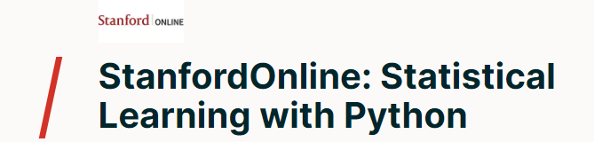

# Stanford Statistical Learning with Python

* [Stanford Statistical Learning](https://online.stanford.edu/courses/sohs-ystatslearningp-statistical-learning-python)
* [Book PDF](https://www.statlearning.com/)
* [Resources](https://www.statlearning.com/resources-python)

## Chapter work

The Python environment may be set up using either PDM or the requirement files.

* [Chapter 2](src/statistical_learning/2-chapter/chapter-2.ipynb)
* [Chapter 3](src/statistical_learning/3-chapter/chapter-3.ipynb)
* [Chapter 4](src/statistical_learning/4-chapter/chapter-4.ipynb)
* [Chapter 5](src/statistical_learning/5-chapter/chapter-5.ipynb)
* [Chapter 6](src/statistical_learning/6-chapter/chapter-6.ipynb)
* [Chapter 7](src/statistical_learning/7-chapter/7-chapter.ipynb)
* [Chapter 8](src/statistical_learning/8-chapter/chapter-8.ipynb)
* [Chapter 9](src/statistical_learning/9-chapter/chapter-9.ipynb)
* [Chapter 10](src/statistical_learning/10-chapter/chapter-10.ipynb)
* [Chapter 11](src/statistical_learning/11-chapter/chapter-11.ipynb)
* [Chapter 12](src/statistical_learning/12-chapter/chapter-12.ipynb)
* [Chapter 13](src/statistical_learning/13-chapter/chapter-13.ipynb)
